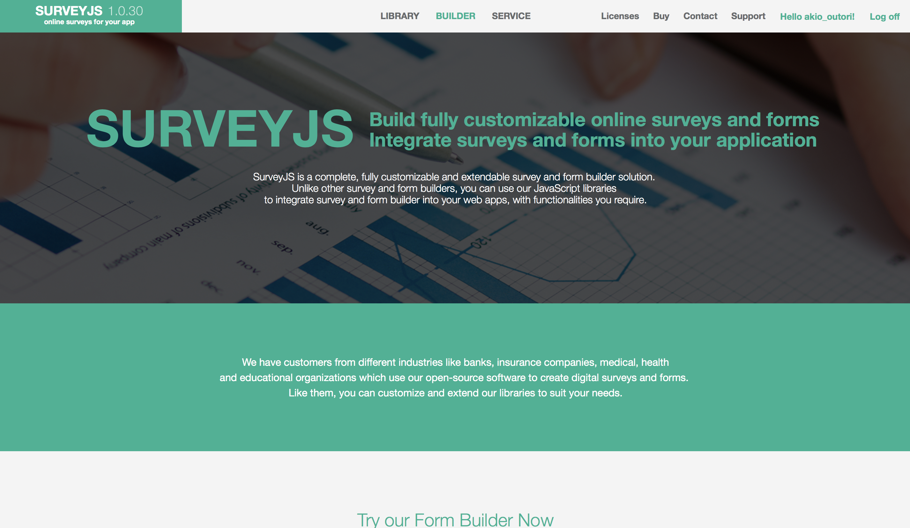
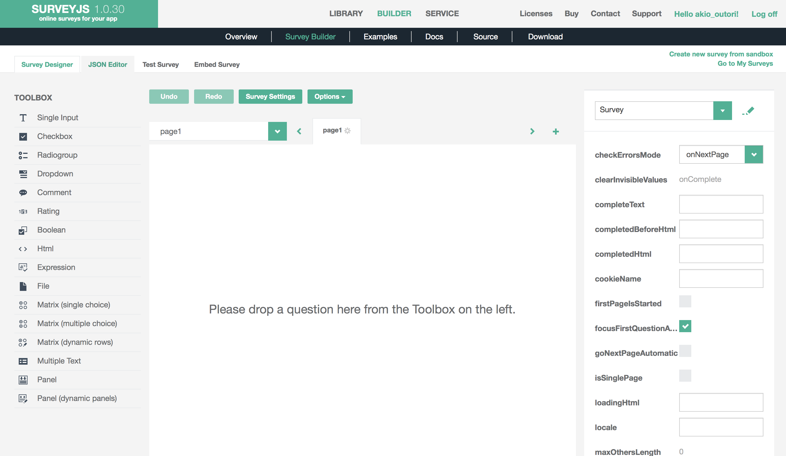
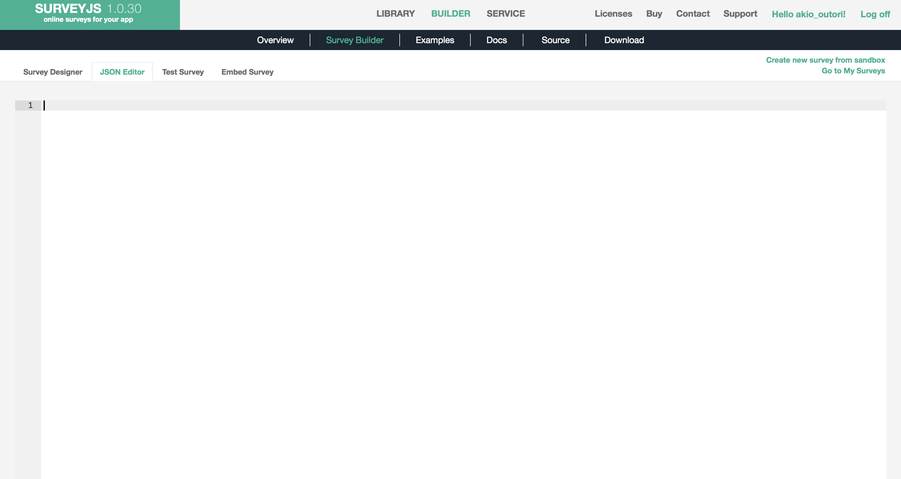
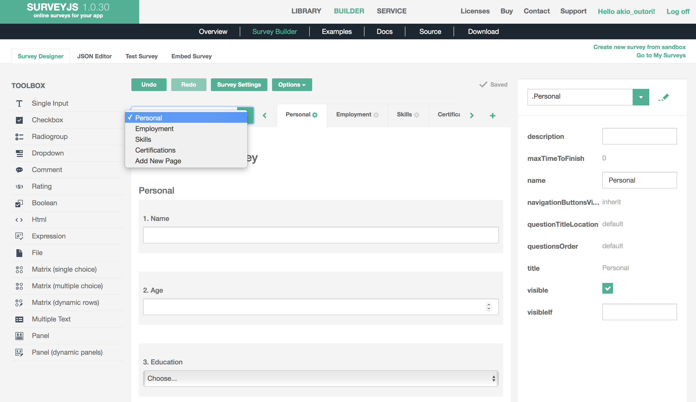

## Talent Pipeline

Talent Pipeline is a surveyjs.io survey document created using the surveyjs editor.  Surveys are saved as a JSON document that can be imported into the web editor.  

### Import Survey Template

To import the survey template:

* Go to https://surveyjs.io
* Log in and Go to **Builder**

* Go to the JSON Editor

* Paste in the JSON template

* Now you've imported the template and can make changes.  Go back to the **Survey Designer** to make changes.

